# **KS0344 Arduino Automatic Watering System DIY Kit for Maker**

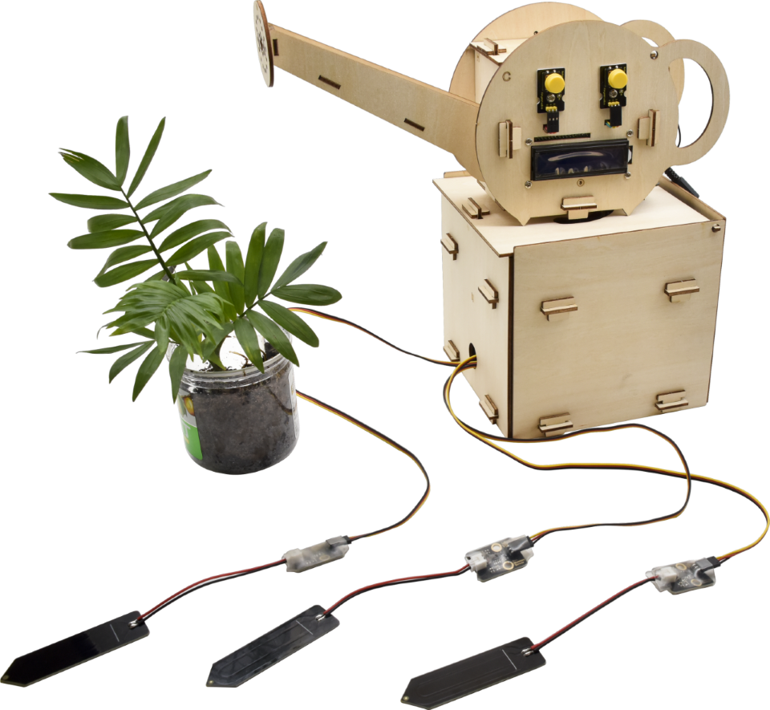

Note: Please keep circuit away from water when self-watering device works

## 1. Description：

Indulged in their heavy work, travel and other activities, people often forget to water their plants. As a result, plants are wilting for lack of water.

In order to tackle this tough problem, we launch an automatic watering system based on Arduino. It can water automatically your plants by detecting the ambient temperature and soil humidity. Therefore, no matter where you are, you will be free from the worry about watering your plant.

That sounds amazing! Right? Let’s get started.

## 2. Instruction：

Arduino automatic watering device, an open resource programming kit, makes teenagers acquire the practical knowledge of electronics, machinery, control logic and computer science easily. It is easy to build by slot connection, wooden boards, plus thirteen projects from simple to complex. Furthermore, the kids’ hands-on ability and way of thinking will be greatly enhanced after building up their own watering device.

## 3. Features：

1. Multi-purpose：**timing watering mode and sensor detection mode**

2. High waterproof：capacitive soil sensor is waterproof**

3. Easy to build：**slot connection,** without the need of soldering circuit.  

4. Novel structure**： spray kettle shape, real and stable**

5. High extension: can expand sensor shield and other sensors and modules

6. Basic programming：C language code of Arduino IDE.

## 4. Product Kit：

| ##  | Name                                                              | QTY | Picture                                                                                                                                                                                                                                                                                    |
|-----|-------------------------------------------------------------------|-----|--------------------------------------------------------------------------------------------------------------------------------------------------------------------------------------------------------------------------------------------------------------------------------------------|
| 1   | Keyestudio PLUS Control Board （Compatible with Arduino UNO ）    | 1   | 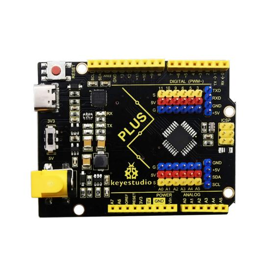                                                                                                                                                                                                                                           |
| 2   | Keyestudio Sensor Shield V5.2                                     | 1   |  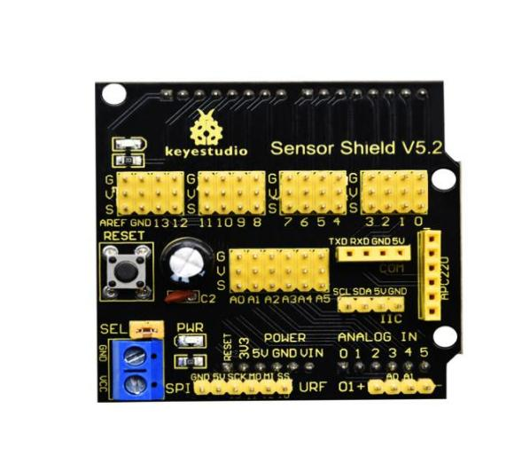                                                                                                                                                                                                                                          |
| 3   | Keyestudio Push Button Module                                     | 2   | 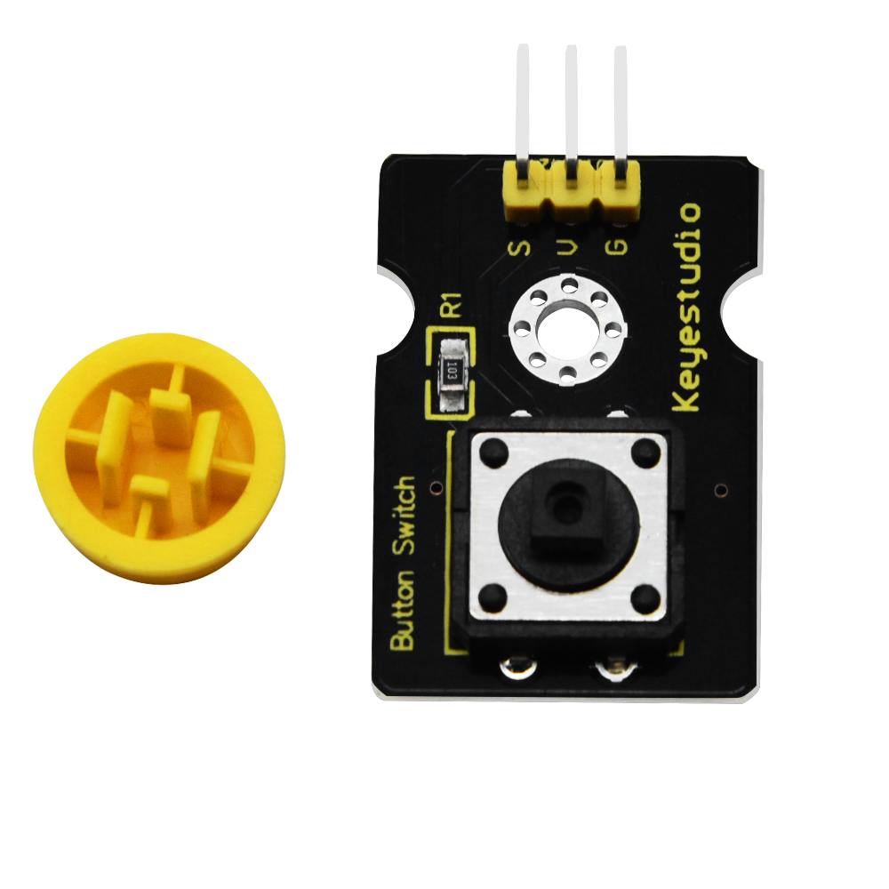                                                                                                                                                                                           |
| 4   | Button Cap                                                        | 2   | 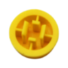                                                                                                                                                                                           |
| 5   | Keyestudio IIC 1602 LCD Module                                    | 1   | 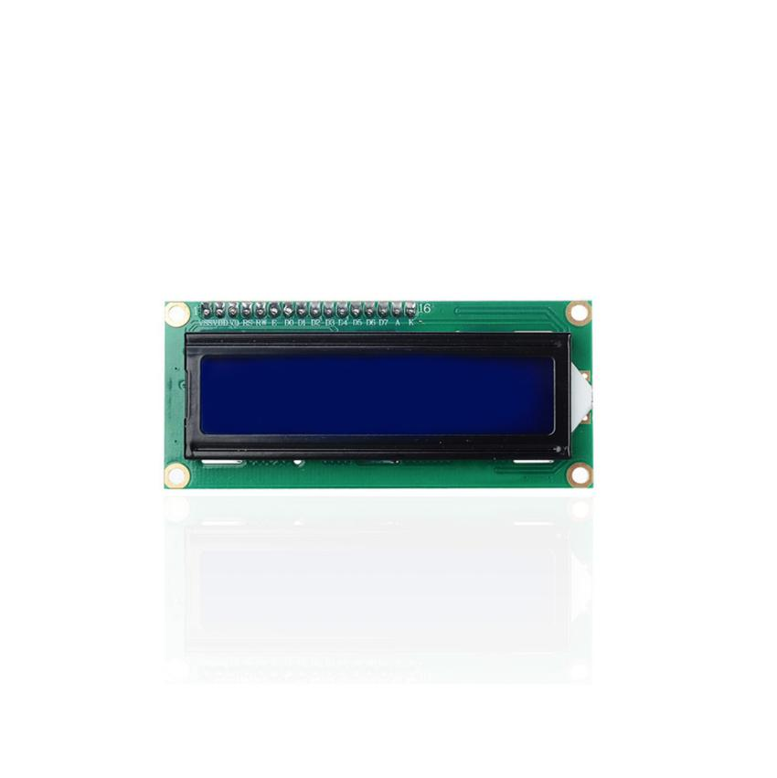                                                                                                                                                                                                                                           |
| 6   | Keyestudio MG996R Servo                                           | 1   | 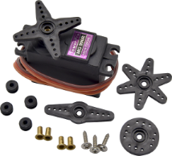                                                                                                                                                                                                                                            |
| 7   | Keyestudio Power Amplifier Module                                 | 1   | 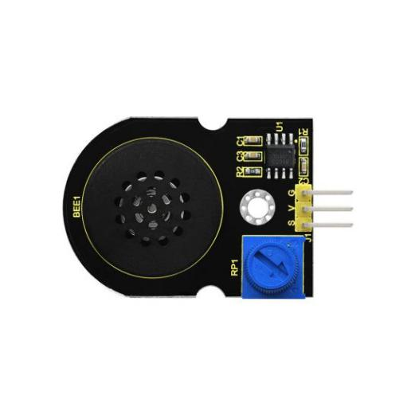                                                                                                                                                                                                                                           |
| 8   | Keyestudio DHT22 Temperature and Humidity Sensor                  | 1   | 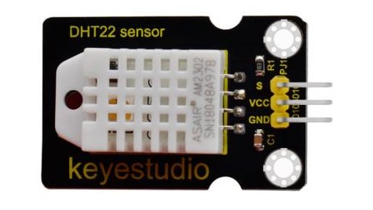                                                                                                                                                                                                                                       |
| 9   | Keyestudio DS3231 Clock Module                                    | 1   | 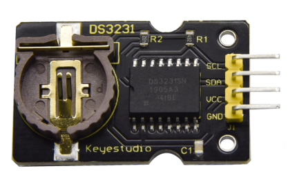                                                                                                                                                                                                                                        |
| 10  | Keyestudio Non-contact liquid level sensor （With adhesive tape） | 1   | 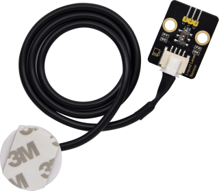                                                                                                                                                                                                                                            |
| 11  | Keyestudio Motor Driver Module                                    | 1   | 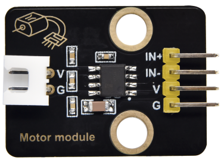                                                                                                                                                                                                                                        |
| 12  | Keyestudio Capacitive Soil Humidity Sensor （waterproof）         | 3   | 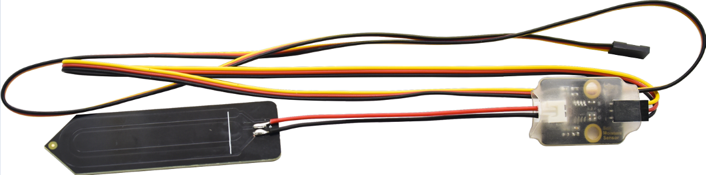                                                                                                                                     |
| 13  | Water Pump                                                        | 1   | 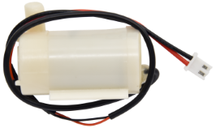                                                                                                                                                                                                                                        |
| 14  | Wooden Boards                                                     | 1   | 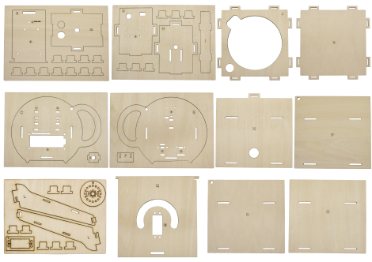                                                                                                                                                                                                                                            |
| 15  | Flexible Bucket                                                   | 1   |                                                                                                                                                                                                                                            |
| 16  | 6-slot AA Battery Holder                                          | 1   | 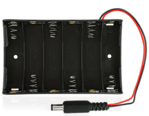                                                                                                                                                                                                                                            |
| 17  | 18650 2-slot Battery Holder                                       | 1   | 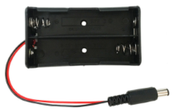                                                                                                                                                                                                                                            |
| 18  | White Pipe                                                        | 1   |                                                                                                                                                                                                                                            |
| 19  | 3pin F-F Dupont Line                                              | 5   | 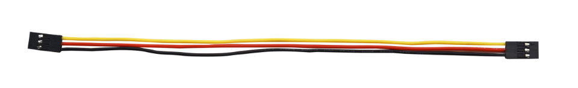                                               |
| 20  | F-F Dupont Line                                                   | 1   | 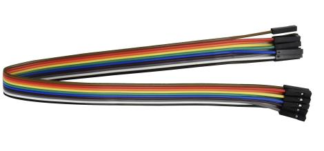                                                                                                                                                                                                                                           |
| 21  | M3\*10MM Dual-pass Copper Pillar                                  | 4   | 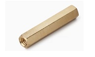                                                                                                                                                                                                                                           |
| 22  | M3 Nuts                                                           | 22  | 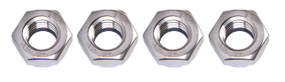                                                                                                                                          |
| 23  | M3\*16MM Round Head Screws                                        | 6   | 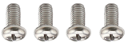                                                                                                                                          |
| 24  | M3\*8MM Round Head Screws                                         | 12  |                                                |
| 25  | M3\*6MM Round Head Screws                                         | 10  |                                                |
| 26  | M3\*10MM Flat Head Screws                                         | 4   | 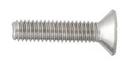                                                                                                                                                                                           |
| 27  | 3\*40MM Screwdriver                                               | 1   |                                                                                                                                                                                                                                             |
| 28  | USB Cable                                                         | 1   | 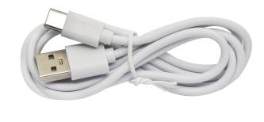                                                                                                                                                                                                                                           |
| 29  | Battery**（not included）**                                       |     |                                                                                                                                                                                                                                                                                            |

## 5. Keyestudio PLUS Control Board：

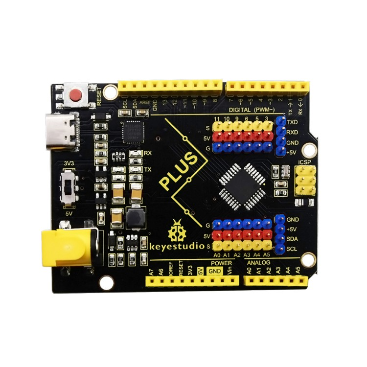

After downloading software, let’s get to know Keyestudio PLUS development board.
It is the core of the following courses.

Keyestudio PLUS Control Board is fully compatible with Arduino UNO R3 board. Its functions is as same as Arduino UNO R3 board. Moreover, some improvements made highly strengthen its function. Alternatively, it is the best choice to learn how to build circuit and design code. Let’s get more details for Keyestudio PLUS Control Board, as shown below:

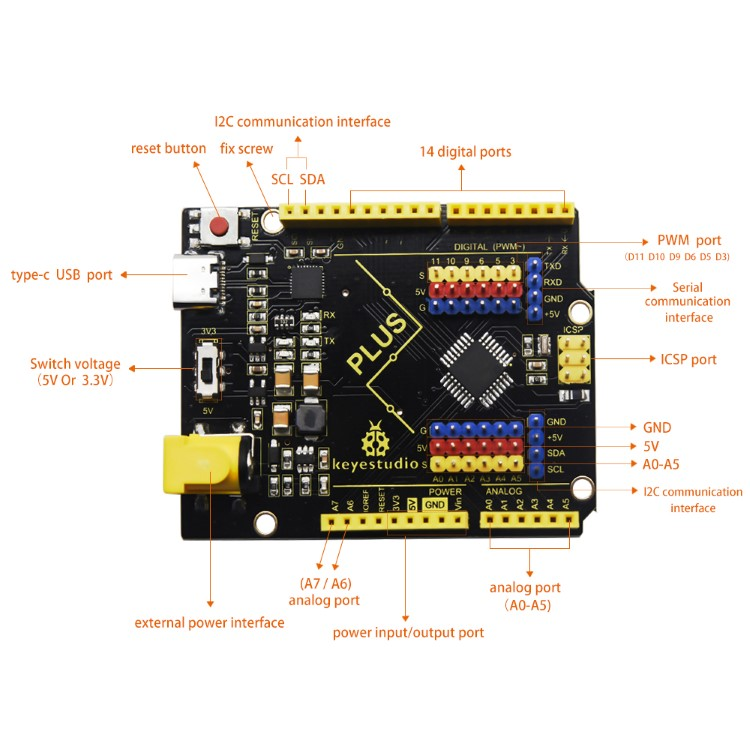

**Parameters：**

| MCU：                         | ATMEGA328P-AU          | USB to serial chip：         | CP2102                              |
|-------------------------------|------------------------|------------------------------|-------------------------------------|
| Working Voltage：             | 5V or 3.3V(DIP switch) | External Power:              | DC 6-15V（recommend 9V）            |
| Digital I/O Port:             | 14 pcs (D0-D13)        | PWM：                        | 6 pcs (D3 D5 D6 D9 D10 D11)         |
| Analog Input Path(ADC):       | 8个(A0-A7)             | Each I/O DC Output Capacity: | 20 mA                               |
| Output capacity of 3.3V port: | 50 mA                  | Flash memory：               | 32 KB(guidance program uses 0.5 KB) |
| Static Register               | 2 KB (ATMEGA328P-AU)   | Read-Only Memory：           | 1 KB (ATMEGA328P-AU)                |
| Clock Speed:                  | 16MHz                  | On-board LED pin:            | D13                                 |

Serial communication interface: D0 is RX, D1 is TX.  
PWM interface (pulse width modulation): D3 D5 D6 D9 D10 D11.  
External interrupt interface: D2 (interrupt 0) and D3 (interrupt 1).  
SPI communication interface: D10 is SS, D11 is MOSI, D12 is MISO, D13 is SCK.  
IIC communication port: A4 is SDA, A5 is SCL.

## 6. Install Arduino IDE on Windows System

**6.1 Download Arduino：**

When we get control board, we need to download Arduino IDE and driver firstly.

You could download Arduino IDE from the official website:

<https://www.arduino.cc/>, click the **SOFTWARE** on the browse bar, and click
“DOWNLOADS” to enter download page, as shown below:


You will view various versions of Arduino like Windows, Mac, Linux and so on.


Then select the version you want to download.

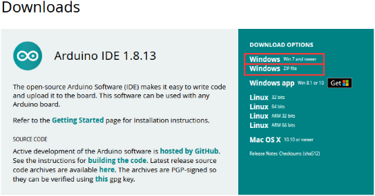

What’s more, you can download the previous edition. In this tutorial, we use 1.8.13 version.

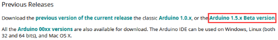

Click **Windows Win7and** newer to download Arduino manually, however, you can tap **Windows ZIP file** to unzip and install Arduino directly.


Click **JUST DOWNLOAD**

After the download, you need to install it.

Select components to install and click“Next”

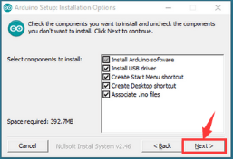

Select the installation folder and tap“Install”

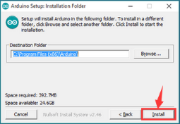

Then wait for extracting the files to be installed.

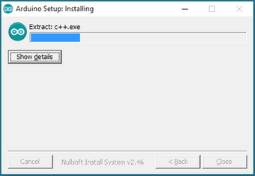

**6.2 Install Driver of Control Board**

Next, let’s install the driver of Keyestudio PLUS control board. The USB-TTL chip on PLUS board adopts CP2102 serial chip. The driver program of this chip is included in Arduino 1.8 version and above, which is convenient. Therefore, when USB cable is plugged, the computer can recognize the hardware and automatically install the driver of CP2102.

Note: The driver of CP2102 needs downloading if your Arduino IDE is below 1.8 version.

Download the driver of CP2102 ：https://fs.keyestudio.com/CP2102-WIN

You have to install manually if your PC system is Windows7/8. The installation steps are shown below:

If the driver is installed unsuccessfully on Windows 10, you need to open the device manager of computer.

Right click Computer----- Properties----- Device Manager

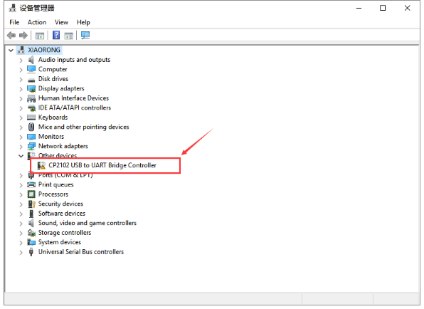

There is a yellow exclamation mark on the page, which implies installing the driver of CP2102 unsuccessfully. Then we double-click the hardware and update the driver.

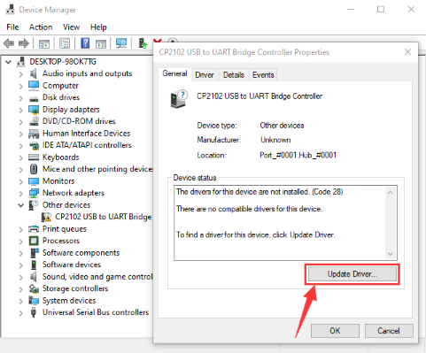

Click“browse my computer for updated driver software”, and find out the installed or downloaded Arduino software. As shown below:

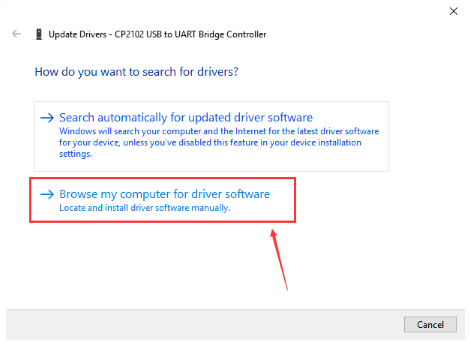

There is a DRIVERS folder in Arduino software installed package（）, open driver folder and check the driver of CP210X series chips.

We click“Browse”to find out the driver folder, click“Next”, then the driver will be installed successfully. (I place Arduino software folder on the desktop, you could follow my way)

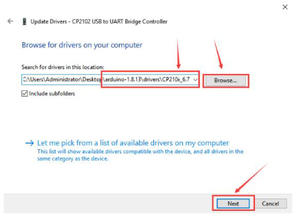

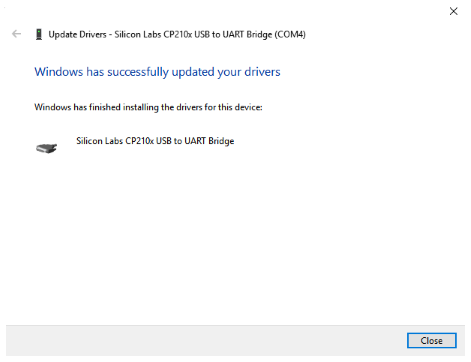

When opening device manager, we will find the yellow exclamation mark disappear.
The driver of CP2102 is installed successfully.

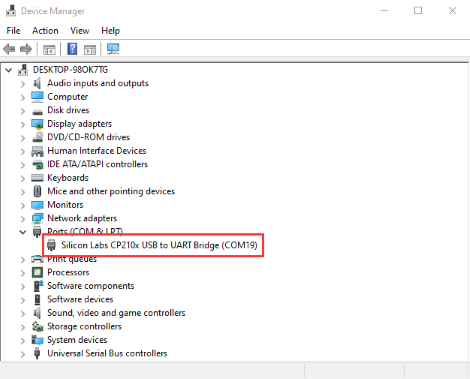

**6.3 Arduino IDE Setting**

Clickicon，open Arduino IDE.

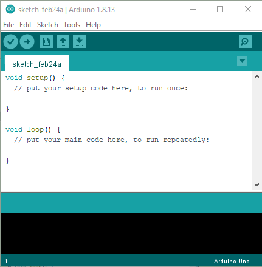

To avoid the errors when uploading the program to the board, you need to select the correct Arduino board that matches the board connected to your computer.

Then come back to the Arduino software, you should click Tools→Board, select the board. (as shown below)

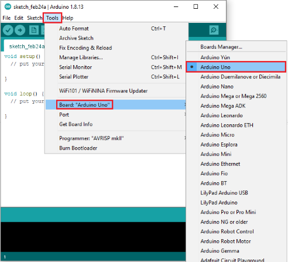

Then select the correct COM port (you can see the corresponding COM port after the driver is successfully installed)


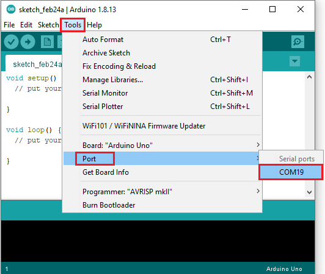

Before uploading the program to the board, let’s demonstrate the function of each symbol in the Arduino IDE toolbar.

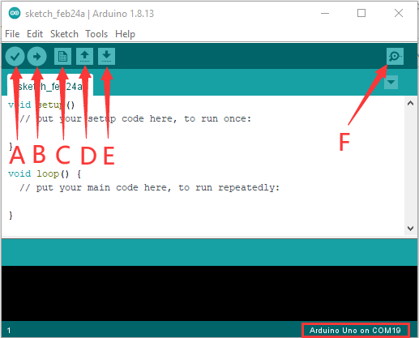

A- Used to verify whether there is any compiling mistakes or not.  
B- Used to upload the sketch to your Arduino board.  
C- Used to create shortcut window of a new sketch.  
D- Used to directly open an example sketch.  
E- Used to save the sketch.  
F- Used to send the serial data received from board to the serial monitor.

**6.4 Start your first program**

Open“**File**”to select Example, and choose BLINK from BASIC, as shown below:

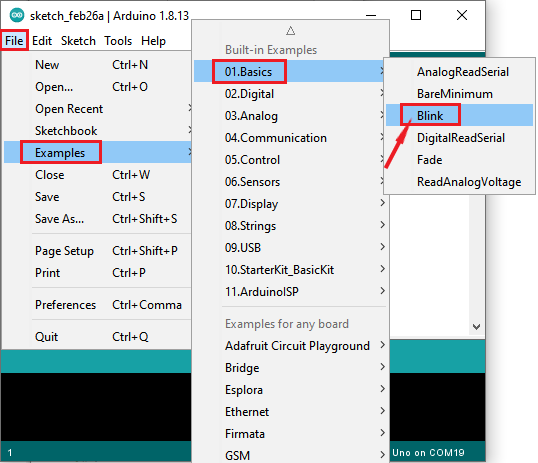

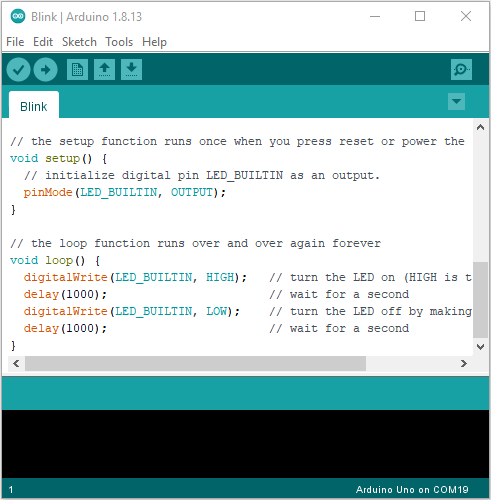

Set board and COM port, the corresponding board and COM port are shown on the lower right of IDE.

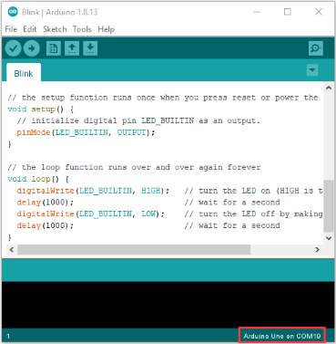

Clickto start compiling the program and checking errors.

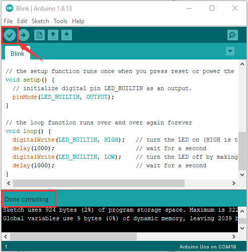

Clickto upload the program

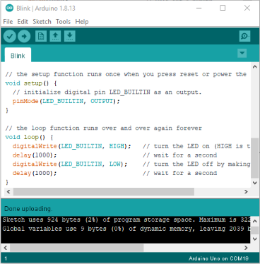

Upload the program successfully, the on-board LED blinks for 1s. Congratulation, you finish the first program.

## 7. Install Arduino IDE on MAC System


**Download the Driver of CP2102**

https://fs.keyestudio.com/CP2102-MAC

**How to Install the Driver of CP2102**

Interface Plus control board with Mac and open Arduino IDE.

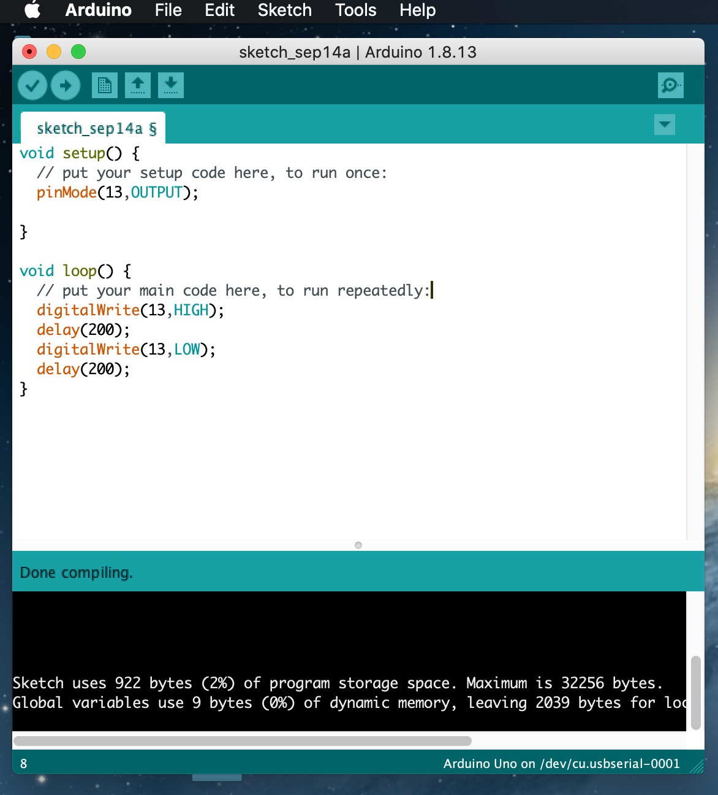

Click **Tools** to select **Board“Arduino Uno”**and **/dev/cu.usbserial-0001.**

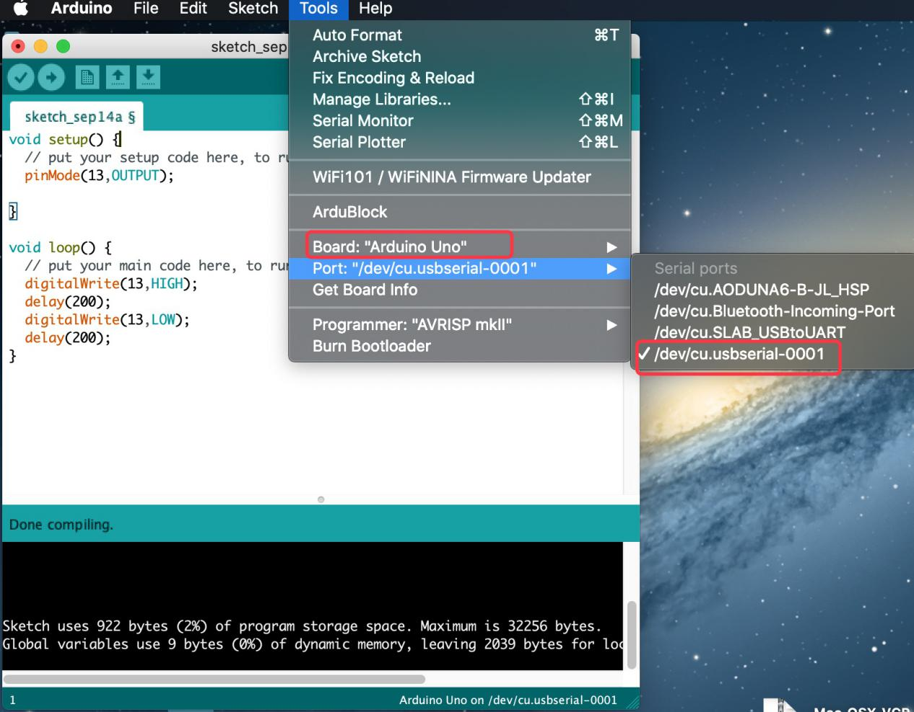

Clickto upload code. **Done uploading** will appear if the code is uploaded successfully.

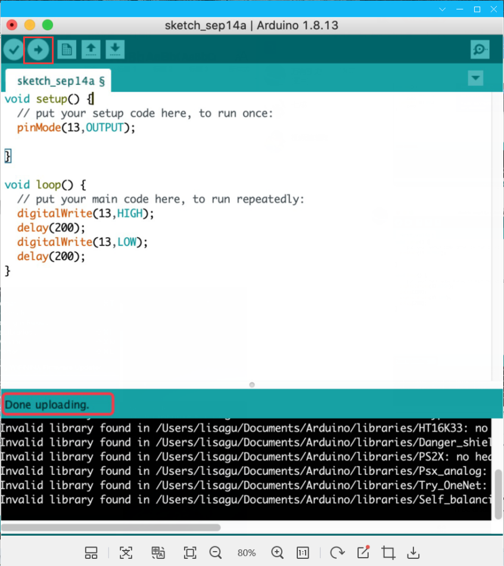

**Note: you skip the following steps if code is uploaded successfully**

**However, you have to follow the below steps to install the driver of CP2102 if the code is uploaded unsuccessfully.**

1.  Download the driver of CP2102:

<https://www.silabs.com/products/development-tools/software/usb-to-uart-bridge-vcp-drivers>

2.  Select Mac OSX edition.

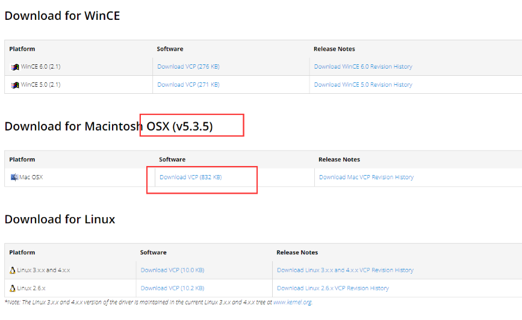

3.  Unzip the downloaded package.


4.  Open folder and double-click **SiLabsUSBDriverDisk.dmg** file.


5.  You will view the following files as follows:


6. Double-click Install CP210x VCP Driver, tick **Don’t warn me....image** and tap **Open.**


7. Tap **Continue**


8.  Select **Agree** and tick **Continue**


9.  Click **Continue** and input your password


10. Click **Open Security Preferences**


11. Click  to unlock security & privacy preference.


12.  Tap **Unlock and** enter **your Username and password**


13. Then click **Allow**


14. Back to installation page, and wait to install.


15.  Successfully installed


16.  Then enter ArduinoIDE, click **Tools** and select Board **Arduino Uno** and **/dev/cu.SLAB_USBtoUAPT**


17.  Click to upload code and show“**Done uploading**”.


## 8. How to Import Libraries?

**What are Libraries ?**

[Libraries](https://www.arduino.cc/en/Reference/Libraries) are a collection of code that makes it easy for you to connect to a sensor,display, module, etc.

For example, the built-in LiquidCrystal library helps talk to LCD displays. There are hundreds of additional libraries available on the Internet for download.

The built-in libraries and some of these additional libraries are listed in the reference.

We will demonstrate the simplest way to import libraries.

**Step 1：**After downloading well the Arduino IDE, you can right-click the icon of Arduino IDE. Find the option "Open file location" shown as below:

[](http://wiki.keyestudio.com/index.php/File:Libraries_1.png)

**Step 2:** Enter it to find out libraries folder, this folder is the library file of Arduino.


**Step 3：**Next to find out the “libraries” folder of watering device(seen in the link: https://fs.keyestudio.com/KS0344


## 9. Keyestudio Sensor Shield V5.2：


In the experiment, we interface numerous sensors and modules with board, yet, the ports of shield are not too much.

To tackle this problem, we design a V5.2 sensor shield which is compatible with Keyestudio PLUS control board.

This shield extends major interfaces (analog ports and digital ports) as 3PIN pins headers. It also leads out the commonly used communication ports as well, such as serial communication, IIC communication, SPI communication. What’s more, the shield comes with a reset button and 2 signal lights.

**Parameters：**

| Extend an Arduino Reset button                                          | come with electrolytic a capacitor and a ceramic capacitor | Come with a built-in power indicator and a D13 indicator |
|-------------------------------------------------------------------------|------------------------------------------------------------|----------------------------------------------------------|
| Lead out a serial communication port                                    |  Lead out a I2C communication interface                    |  Lead out A SPI communication interface                  |
| Lead out a URF interface                                                | Lead out an APC220 port                                    | a external power port(less than 5V)                      |
| Breakout all the digital and analog ports of PLUS board as 3PIN headers |                                                            |                                                          |

**Pinout：**


Insert Keyestudio Sensor Shield V5.2 into PLUS board, build up a circuit experiment, upload code to control LED on and off to PLUS board and plug in power, as shown below:


## 10.Install Automatic Watering System：

| **Precaution**                                                                                                                                                                                                                                                                                                                                                                                                                      |
|-------------------------------------------------------------------------------------------------------------------------------------------------------------------------------------------------------------------------------------------------------------------------------------------------------------------------------------------------------------------------------------------------------------------------------------|
| There are numbers marks on each board. The side with numbers is front side. You need to install 6-slot battery holder onto the“Back side”of boardif you choose AA battery as power supply. Install slot joints gently and don’t press board too hard  Install board A and Q gently because their protruding ends are weak.（） Set the initial angle of servo before installing it.  |

**Initialize Servo：**

The initial angle of servo needs adjusting 90° before installing it.

Stack sensor shield onto PLUS control board, connect servo to sensor shield and upload code to make servo rotate to 90° .

| Servo       | Sensor Shield |
|-------------|---------------|
| Brown Wire  | G             |
| Red Wire    | V             |
| Orange Wire | S（9）        |

**Connection Diagram：**


**Test Code：**
```c++
include <Servo.h> //Contains the steering gear library code

Servo myservo;

void setup() {
myservo.attach(9); //The steering gear is connected with digital port 9
}

void loop(){
myservo.write(90);
delay(500);
}
```


**Test Result：**

Wire up, upload code and plug in power firstly. Then servo will rotate to the set initial angle.

**Install Automatic Watering System**

|    Installation Steps      |                          |
|     :------------          |    --------------        |
|  Part 1                    |                          |  
|  Required parts：          |      |
|                            |   |
|                            |   |
|  Part 2                    |                          |
|  Required parts：          |  |
|                            |   |  
|  Part 3                    |                          |                   
|  Required Parts：          |  |
|                            |   |
|  Part 4                    |                          |                                                                                                                                                                                                                                                  
|  Required Parts:           |  |                                                                                                                                                                                                    
|                            |   |
|                            |  Note: install 6-slot AA battery holder on the board A The ports of battery holder and control board are in same side.   |
|  Part 5                    |                          |
|  Required parts：          |  |
|                            |  |
|                            |  |
|  Part 6                    |                          |   
|  Required parts：          |   |
|                            |   |
|                            |   |
|  Part 7                    |                          |
|  Required parts：          |   |
|                            |   |  
|                            |   |
|                            |   |
|  Part 8                    |                          |
|  Required parts：          |   |
|                            |   |
|                            |   |    
|                            |    | 
|   Install the protruding ends of board A gently because they are weak |  |
|  Insert a protruding end of board A into a hole of board E.  Don’t press too hard, the slot joint is weak.  Then insert the  another end of  board A into a  hole of board C |  |
|                            |  |
|                            |  |
|  Part 9                    |                          |
|  Required  Parts           |   |
|                            |   |
|                            |  |
|  Attention the hole of board P               |  |
|                            |  |
|                            |  |
|                            |  |
|  Attention the hole of board S |  |
|                            |   |
|  Wiring Up                 |                          |
|  Install and place three soil sensors                 |    |
|  Flexible barrel+ Non-contact level liquid Sensor：   |  |
|  Mount the non-contact liquid level sensor onto collapsible bucket, Glue the sensor onto bucket after tearing off the thin film |   |  
|  Place bucket on the base board.   Attention the location of non-contact liquid level sensor |    |
|  Take out slot and open board A  |   |
|  Install pipe              |  Insert water pipe from an end  Remove round board and insert pipe into the above hole   insert pipe into the central of round board \> 5mm   Insert the other end of pipe into the above hole.  |
|  Attach pipe to water pump |   |
|  Remove the connection board of liquid level sensor |  |
|  Insert the wire cables of three soil sensors, water pump, liquid level sensor and servo into the above hole |   |
|  Leave water pump in the bucket  |   |
|  When filling the water tank, do not exceed the J plate (the support plate of the bucket)  |  |
|  Insert the protruding ends of upper part into the holes of board P and S  |  |
|  Fix upper part via slot connection |  |
|  Insert the end of water pump to motor driver module |   |
|  attach the end of non-contact liquid level sensor to liquid level sensor. |   |
|  **Connection Diagram**     |   |                                                                                                                                                                                                                                                                          
|  Wire up Push Button 1      |    |
|  Wire up Push Button 2      |    |
|  Hook Up Non-contact liquid level sensor |    |
|  Wire up Motor Driver Module  |   Attach the end of water pump to motor driver module, then connect motor driver module to sensor shield via dupont line. |
|  Wire up Humidity and Temperature Sensor  |    |
|  Hook up MG996R Servo  |     |
|  Hook up Power Amplifier Module |    |
|   Wire up Soil Humidity Sensor1 |      |
|   Wire up Soil Humidity Sensor2 |      |
|  Wire up Soil Humidity Sensor3  |      |
|  Hook up 1602 LCD Display Module |     |
|  Hook up DS3231 Clock Module |    |
|  If all wire cables are hooked up well, insert slot to fix board A together  |        |
|  Note: Cut off power wire and USB cable when board A is opened. |  |                                                                                                                                                                                                                                                 
|                                 |   |                                                                                                                                                                                                                                                                          
|                                 |   Insert soil humidity sensors along the edge of flower pots to keep them from water.  |       

## 11.Projects：

The automatic watering device is installed well. Next, let’s explore how it works and learn the knowledge of basic components like push button module, DHT22 temperature and humidity sensor, clock module and so on.

You will From basic sound experiment to watering function,

Note: The pin G marked on sensors and modules are negative poles, which is interfaced with G, - or GND of sensor shield; similarly, pin V is positive pole, which is connected to V, VCC or 5V of sensor shield.

Then plug in external power after burning code.

### Project 1 Play Sound


(1) Description：

We can use Arduino to make many interactive works of which the most commonly used is acoustic-optic display.

The circuit in this experiment can produce sound. Normally, the experiment is done with a buzzer or a speaker while buzzer is simpler and easier to use. In this project, this power amplifier module is equivalent to passive buzzer. It can emit“do re mi fa so la si do”sound via code.

**Parameters：**

| Working Voltage：          | DC 5V   | Working Current：     | ≥500mA | Control Port：         | Digital Port  |
|----------------------------|---------|-----------------------|--------|-----------------------|---------------|
| Amplifier chip：           | SC8002B | Working Temperature： |  0-40℃|  Size：                |  47\*30\*13MM |
| Environmental attributes： | ROHS    |  Speaker power：      |  0.15W | Speaker sound volume： |  80db         |

Test Code 1：

Note: G, V and S of power amplifier module are respectively interfaced with G, V, and S(11) of expansion board

<iframe src=https://create.arduino.cc/editor/keyestudio/d00e7119-14da-4e2e-8f87-3bc578c015af/preview?embed style="height:510px;width:100%;margin:10px 0" frameborder=0></iframe>


Test Result1：

Upload code and plug in power firstly. Then power amplifier module will emit“do re mi fa so la si do”

Expansion Projects 2：Play Music

<iframe src=https://create.arduino.cc/editor/keyestudio/ea60b8e9-1ee4-4f1b-a18a-1b597a28a37c/preview?embed style="height:510px;width:100%;margin:10px 0" frameborder=0></iframe>


Test Result2：

Upload code and plug in power firstly. Then power amplifier module play Happy Birthday song.

### Project 2: Push Button Module


Instruction：

Button can control the on and off in the circuit.

Before pressed, the current can’t pass from one end to the other end. Both ends are like two mountains. There is a river in between. We can't cross this mountain to another mountain. When pressed, my internal metal piece is connecting the two sides to let the current pass, just like building a bridge to connect the two mountains. Its inner structure:


When button is not pressed, 1 and 1, 2 and 2 are connected; however, 1 and 2 are connected when the button is pressed.

In the project, we will control buzzer via button module.

 Parameters：

| Working Voltage：     | ＜36V（DC） | Working Current： | ＜7.6mA | Control Signal： | Digital Signal |
|-----------------------|-------------|-------------------|---------|------------------|----------------|
| Working Temperature： | -10℃\~+50℃  | Weight：          | 3.8g    |                  |                |

(3) Test Code 1：read the signal of push button module

The pin G, V and S of button 1 are separately connected to G, V and S(2) of expansion board.

<iframe src=https://create.arduino.cc/editor/keyestudio/1b45f051-d273-4257-bfb0-ca73f4961208/preview?embed style="height:510px;width:100%;margin:10px 0" frameborder=0></iframe>


(4) Test Result1：

Upload code and plug in power, open serial monitor and set baud rate to 9600 firstly. The monitor shows number 1 when button1 is not pressed but number“0”will be displayed when button1 is pressed.


(5) Code Expalnation:

**Serial.begin(9600)** initialize serial communication and set baud rate to 9600

**pinMode(pin, INPUT)** You need to express INPUT and OUTPUT to development board before using the pin of Arduino

**digitalRead(pin)** read the digital level(HIGH or LOW) of pin, that is, 1 and 0

Expansion Project 2：control power amplifier module to emit sound.

The pin G, V and S of button module are connected to G, V and D2 of expansion board.

<iframe src=https://create.arduino.cc/editor/keyestudio/ca034fe5-7dce-4836-9ec3-92773d404f06/preview?embed style="height:510px;width:100%;margin:10px 0" frameborder=0></iframe>


Test Result2：

Upload code 2 and plug in power firstly. Then the power amplifier module will play sound when button1 is pressed, yet, it won’t emit sound when button 1 is released.

### Project 3: Servo Control


(1) Description：

MG996R servo is a metal gear servo motor with housing, circuit, seedless motor, gear and location detector. For servos, we only control its angle.

When the motor speed is constant, the potentiometer is driven to rotate through the cascade reduction gear, which leads that the voltage difference is 0, and the motor stops rotating. Generally, the angle range of servo rotation is 0°\--180 °


In general, servo has three line in brown, red and orange. Brown wire is grounded, red one is positive pole line and orange one is signal line.

(2) Control Principle of MG996R Servo：

Its servo system is controlled by changeable pulse width. And orange wire is used to transmit pulse.

The standard cycle of PWM signal is 20ms (50Hz). Theoretically, the width is distributed between 1ms-2ms, but in fact, it's between 0.5ms-2.5ms. The width corresponds the rotation angle from 0° to 180°. But note that for different brand motor, the same signal may have different rotation angle.


Through the practical test, the pulse range of Mg996 servo is 0.65ms\~2.5ms.

180° Servo:

| Time of high level | Servo Angle | Benchmark signal cycle time（20ms） |
|--------------------|-------------|-------------------------------------|
| 0.65ms             | 0°          | 0.65ms high level+19.35ms low level |
| 1.5ms              | 90°         | 1.5ms high level+18.5ms low level   |
| 2.5ms              | 180°        | 2.5ms high level+17.5ms low level   |

 Parameters：

| Working Voltage：           | 4.8 \~ 6V                                                | Torque：           | 9kg/cm(4.8V)，11kg/cm(6V) |
|-----------------------------|----------------------------------------------------------|--------------------|---------------------------|
|  No load speed:             | 0.19s/60°(4.8V)，0.18s/60° (6V) \##0.19/60=0.0032s/degree |   Rotation Angle： |   180°                    |
| Response Pulse Width Time： |  ≤5us(ms)                                                |  Gear：            |  Metal gear               |
| Working Deadzone：          | 5us (ms)                                                 | Weight：           | 55g                       |
| Working temperature         |  0°C-55°C                                                |  Dimension：       | 40.8\*20\*38mm            |

(4) Test Code 1：

The brown wire, red wire and orange wire of servo are respectively connected to G, V and S(9). Furthermore, the servo must be connected to external power because of its high demand of current. (if without external power, control board may get damaged.

<iframe src=https://create.arduino.cc/editor/keyestudio/47400408-4972-4534-b87e-e32b1cfb49cc/preview?embed style="height:510px;width:100%;margin:10px 0" frameborder=0></iframe>


(5) Test Result1：

Upload code and plug in power firstly. Then servo will rotate to 0°, 90°, 180°, 90° and 0°.

There is easier way to control servo.

Please refer to the official website:
<https://www.arduino.cc/en/Reference/Servo>.

(6) Test Code 2:

<iframe src=https://create.arduino.cc/editor/keyestudio/550ae4a6-0659-489b-8f8e-df875d6dd7b8/preview?embed style="height:510px;width:100%;margin:10px 0" frameborder=0></iframe>


(7) Test Result 2：

Upload code 2 and plug in power firstly. Then servo will rotate from 0° to 180°.

Code Explanation:

Arduino comes with **\##include \<Servo.h\>** (servo function and statement）.

The following are some common statements of the servo function:

1.  **attach（interface）** ——Set servo interface

2.  **write（angle）** ——used for the statement to set rotation angle of servo, and the set angle range is from 0° to 180°

3.  **read（）** ——used for the statement to read angle of servo, namely, reading the command value of“write()”

4.  **attached（）** ——Judge if the parameter of servo is sent to its interface  

Note: The above written format is“servo variable name, specific statement（）”, for instance: myservo.attach(9)

### Project 4 Control the rotation of Servo：

 (1) Description：

In the lesson, we will combine push button module and MG996R servo. In the experiment, the rotation of servo is controlled by push button module.

(2) Test Code：

<iframe src=https://create.arduino.cc/editor/keyestudio/a10fae97-75d0-4dcc-81a2-25902c6f7e00/preview?embed style="height:510px;width:100%;margin:10px 0" frameborder=0></iframe>

(3) Test Result：

Upload code and plug in power firstly. Then servo will rotate to 180° if the button1 is pressed long, yet, the servo will rotate to 0° if button 2 is pressed long.

### Project 5 DHT22 Temperature and Humidity Sensor：


(1) Description：

This DHT22 digital temperature and humidity sensor is a composite sensor which contains a calibrated digital signal output of the temperature and humidity. The dedicated digital modules collection technology and the temperature and humidity sensing technology are applied to ensure that the product has high reliability and excellent long-term stability. Qualities of excellent quality, ultra-fast response, strong anti-interference, and high cost performance make it a wide applied application or even the most demanding one. The sensor comes with 2 fixed holes, very easy to mount on any other devices.  

**Applications:** dehumidifier, testing and inspection equipment, consumer goods, automotive, automatic control, data loggers, weather stations, home appliances, humidity regulator, medical and other humidity measurement and control.

In this project, we will display the ambient temperature and humidity value on serial monitor.

Parameters：

| Working Voltage：               | DC 3.3V-5V    | Working Current：               | 1.5mA                     | Control  Port：                    | Digital Port  |
|---------------------------------|---------------|---------------------------------|---------------------------|------------------------------------|---------------|
| Stand-by current：              |  50uA         |  Measurement Range：            | 0-99.9%RH                 | Humidity Measurement Accuracy：    |  ±2%RH (25°C) |
| Humidity Measurement Accuracy： |  ±2%RH (25°C) | Temperature Measurement Range： | -20---80℃                 | Temperature Measurement Accuracy： |  ±0.5℃        |
| Temperature resolution：        |  0.1°C        | Output  Signal：                | Single bus digital signal |  Weight：                          |  5.9g         |

Test Code：

The pin G, V and S of DHT22 temperature and humidity sensor are connected to G, V and S(8) of expansion board.

<iframe src=https://create.arduino.cc/editor/keyestudio/3ba04187-ae56-438b-9f1e-8aa84b18c698/preview?embed style="height:510px;width:100%;margin:10px 0" frameborder=0></iframe>


Test Result：

Upload code and plug in power, open serial monitor and set baud rate to 9600.

The monitor shows the ambient temperature and humidity data, as shown below;


### Project 6 16I2C LCD 1602 Module：


(1) Description：


With I2C communication module, this is a display module that can show 2 lines with 16 characters per line.

It shows blue background and white word and connects to I2C interface of MCU, which highly save the MCU resources.

On the back of LCD display, there is a blue potentiometer for adjusting the backlight. The communication address defaults to 0x27.

The original 1602 LCD can start and run with 7 IO ports, but ours is built with ARDUINOIIC/I2C interface, saving 5 IO ports. Alternatively, the module comes with 4 positioning holes with a diameter of 3mm, which is convenient for you to fix on other devices.

Note: GND and VCC of LCD display can’t be connected reversely, otherwise, causing the damage of LCD

Parameters：

| Working Voltage：                                                 | DC5V                                         | I2C Address：                                                     | 0x27                     | Control Port： | I2C      |
|-------------------------------------------------------------------|----------------------------------------------|-------------------------------------------------------------------|--------------------------|----------------|----------|
| Working Current：                                                 | \< 130mA                                     | Working Temperature：                                             | 0°C \~ 45°C（recommend） | Driver Chip：  | PCF8574T |
| GND：a pin to be interfaced with the ground                       |  VCC：Connect to +5V power                   | SDA：a pin to be connected to SDA(A4), used for IIC communication |                          |                |          |
| SCL：a pin to be connected to SCL(A5), used for IIC communication |  Backlight（White text on blue background）  |  Adjusting contrast                                               |                          |                |          |

(3) Test Code：

The pin GND, VCC, SDA and SDL of 1602 I2C module are connected to GND, 5V, SDA and SCL of IIC communication port.

<iframe src=https://create.arduino.cc/editor/keyestudio/3e208f1f-40d7-4690-93bb-ed8b822c3e1b/preview?embed style="height:510px;width:100%;margin:10px 0" frameborder=0></iframe>


(4) Test Result：

Upload code and plug in power firstly. Then 1602 I2C LCD module will show“Hello, world!”and“keyestudio”.

Note: You can rotate the potentiometer to adjust backlight if there is no character on 1602 I2C display module.

### Project 7: Show Temperature & Humidity：

(1) Description：

In DIY projects, we often conduct an experiment with DHT22 temperature sensor and LCD display. At same time, we’ve learned their working principle. Next, we will display the temperature and humidity value on LCD display module.

(2) Test Code：

<iframe src=https://create.arduino.cc/editor/keyestudio/de4a4994-95b1-49d7-98e3-d3768eb3d277/preview?embed style="height:510px;width:100%;margin:10px 0" frameborder=0></iframe>


Test Result：

Upload code, plug in power and open serial monitor. Then the temperature and humidity value will be shown on serial monitor and 1602 LCD display module.

### Project 8: DS3231 Clock Module：


(1) Description：

Clock module can be displayed time and a timer. In this project, we will show time and temperature with DS3231 module.

The clock operation can adopt 24 or 12 hour format through AM/PM indication.

High accuracy and inner temperature compensation of built-in crystal oscillator makes less error. Also, it has automatic compensation for leap-years and for months with fewer than 31 days.

The clock operation can adopt 24 or 12 hour format through AM/PM indication.

DS3231 is used for major power and back-up power. It provides two programmable calendar alarm and 1-channel programmable wave output.

The precise, compensated voltage reference and comparator, supervise the VCC status, detect circuit error, provide reset outputs and switch to back-up power when necessary.

**Parameters: **

| Working Voltage：                                                                                                                                       | 2.3\~5.5V（DC）                     | Timing Accuracy：   | 5ppm(0.432 s/day)              |
|---------------------------------------------------------------------------------------------------------------------------------------------------------|-------------------------------------|---------------------|--------------------------------|
| Voltage：                                                                                                                                               | 2.3\~5.5 V（DC）                    | Working Current：   | 130uA \~ 200uA @ 3.63V \~ 5.5V |
| Output：                                                                                                                                                | 1Hz and 32.768kHz                   | Temperature Range： | -40 \~ +85℃                    |

1. Two calendar clocks                                 
2. High speed(400kHz)， I2C serial bus
3. DS3231Device package and function compatible with DS3231          
4. Complete clock calendar function contains seconds and minutes, hour, week, date, month, and year timing and provides leap year compensation until 2100. 

You can look through detailed information about DS3231 chip in the resource link.

**(3) Test Code：**

The pin GND, VCC, SDA and SCL of DS3231 module are respectively attached to G, V, S(A4) and S(A5)

<iframe src=https://create.arduino.cc/editor/keyestudio/fa0076c8-4929-42a7-8994-c39a2225bb7d/preview?embed style="height:510px;width:100%;margin:10px 0" frameborder=0></iframe>


Test Result：

Upload code and plug in power, open serial monitor and set baud rate to 57600.
The serial monitor shoes the time and temperature, as shown below;


### Project 9: Non-contact liquid level sensor


 (1) Description：

Non-contact liquid level sensors (hereinafter referred to as liquid level sensors) adopt advanced signal processing technology and high-speed signal processing chips to eliminate the influence of container wall thickness and truly non-contact detection of the liquid level in sealed containers.

It can realize the detection of various toxic substances, strong acids, alkalis and various liquids in high-pressure sealed containers.

It is a digital sensor which is simple to use.

The sensor has a DIP switch to control high and low level. For example, the value is 1 when water is detected; however, dial DIP switch to other end, the value will be 0.

There is lid on the sensor. Open it and find out a potentiometer. Then rotate it with a screwdriver. The sensing capacity increases when rotating it anticlockwise; on the contrary, sensing capacity reduces.


(2) Features

A. The non-contact liquid level sensor does not need to be in direct contact with the liquid and will not be corroded by corrosive liquids such as strong acids and alkalis, and will not be affected by scales or other foreign matter.

B. The detection is accurate and stable, and the boiling water can be detected.

C. High stability, high sensitivity, high interference capacity, no external electromagnetic interference, special treatment for power frequency interference and common mode interference, to be compatible with all 5\~24V power adapters on the market.

D. Strong compatibility, through a variety of non-metallic materials containers, such as plastic, glass, ceramics and other containers, the sensing distance of up to 13mm; liquid, powder, particulate matter can be detected.

(3) Parameters：

|                              |                |                      |                                      |                                    |            |
|------------------------------|----------------|----------------------|--------------------------------------|------------------------------------|------------|
|  Input Voltage：             | DC 3.3V-9V     |  Output Voltage：    |  High level（3.3V-9V）  low level 0V |                                    |            |
| Consumption Current ：       |  5mA           | Maximum Power：      |  0.03W                               | Output Current：                   | 1.2\~3.5mA |
|  Environmental  attributes： |  ROHS          | Working Temperature: | 0\~105℃                              | Sensing thickness (sensitivity) ： | 0\~13 mm   |
|  Size：                      | 31.6mm\*23.7mm |                      |                                      |                                    |            |

(4) Abnormal Work


| Trouble：                                                                                                                      | Analysis：                                 | Solution：                                    |
|--------------------------------------------------------------------------------------------------------------------------------|--------------------------------------------|-----------------------------------------------|
| liquid level sensor has no response after power is plugged（Indicator is off when water level reaches to the induction point） | ① Loose contact                            | Check and connect to power well               |
|                                                                                                                                | ② Reverse connection                       | Wire up correctly                             |
|                                                                                                                                |   ③Power module damages                    | Change a new circuit board                    |
|                                                                                                                                | ④Sensitivity is too low                    | Adjust sensitivity                            |
|    Indicator always on                                                                                                         | ①Sensitivity is high                       | Adjust sensitivity                            |
|                                                                                                                                | ②There is impurity and other metals inside | Clear up impurity and keep it away from metal |
|                                                                                                                                | ③container is not insulated completely     | Change a new container or install with holes  |

(5) Test Code：

The pin G, V and S of non-contact liquid level sensor are respectively connected to G, V and S（4）and the pin G, V and S of power amplifier module are attached to G, V and S（11）of expansion board.

<iframe src=https://create.arduino.cc/editor/keyestudio/90a8c33e-eeaa-48df-852a-5b024b2bd8df/preview?embed style="height:510px;width:100%;margin:10px 0" frameborder=0></iframe>


(6) Test Result：

Upload code, plug in power, dial the DIP switch to SET end, open serial monitor and set baud rate to 9600.

The indicator of liquid level sensor will be on, number 1 will be shown on serial monitor and buzzer will play sound if the liquid is detected, as shown below;


### Project 10 Capacitive Soil Humidity Sensor：

Description：

Different from most of soil moisture sensors in the market, it adopts the capacitive sensing theory to detect soil moisture and avoid being corroded, greatly extend its life expectancy.

At same time, it reacts quickly and works at -10℃\~60℃. In addition, it features the high waterproof performance because of waterproof layers on its circuit part.

The built-in voltage stability chip supports 3.3\~5.5V working environment, which means that it is compatible with most of main control boards

Connected with a LCD screen and an Arduino board, a soil moisture sensor will help you detect soil moisture if your plant is thirsty.

Parameters：

| Working Voltage: | DC3.3 \~ 5V    | Output Voltage: | 0 \~ 3V  |
|------------------|----------------|-----------------|----------|
| Output Signal：  |  Analog Signal |                 |          |

Test Code 1：（Dry and humidity calibration）

The G, V and S of capacitive soil humidity sensor are connected to G, V and S(A0).

Limit a measurement range by reading the analog value in the air and water

<iframe src=https://create.arduino.cc/editor/keyestudio/0c0b4702-1619-4b58-99e7-0a2966bca92a/preview?embed style="height:510px;width:100%;margin:10px 0" frameborder=0></iframe>


Test Result1：

Upload code 1, plug in power, open serial monitor and set baud rate to 9600. Then soil humidity sensor will read the analog value.

Place soil humidity sensor in the air to read the analog value, as shown below:


**We will conduct an experiment to get the ideal soil moisture value(full of water in the flowerpot):**

We provide a cup of water, insert sensor in the water(don’t emerge the white warning line of this sensor) , and record the analog value, as shown below; (Output data is inverse proportion to humidity, and analog value in the water is minimum)


Test Code2：(set interval)

We divide the humidity into three levels which are dry, wet, pretty wet.

Through the above code, the value is 591 when the sensor is in the air, while the value is 285 when it is in the water. So, the D-value in each interval =(591\- 285)/3=102

【591，489】,【489，387】and【387，285】stand for dry, wet and pretty wet.

<iframe src=https://create.arduino.cc/editor/keyestudio/ce190c4d-d1be-4963-8249-b6c3b16cffe7/preview?embed style="height:510px;width:100%;margin:10px 0" frameborder=0></iframe>

(6) Test Result2：

Upload code2, plug in power, open serial monitor and set baud rate to 9600.

On the condition that soil in your flowerpot is wet, insert the sensor into the soil gradually, then serial monitor will show“Dry”, “Wet” and “pretty Wet”, as shown below;


Note: the soil humidity and looseness and measure depth can cause different moisture.

(7) Test Code3：

In order to observe the soil humidity value, we will display it on LCD 1602 display.

The pin G, V and S of soil humidity sensor are connected to the pin GND, 5V, SDA and SCL of IIC communication port.

<iframe src=https://create.arduino.cc/editor/keyestudio/53b54c59-f56d-48ad-a4e3-fcdae23ef5ea/preview?embed style="height:510px;width:100%;margin:10px 0" frameborder=0></iframe>


(8) Test Result 3：

Upload code 3 and plug in power firstly. Then 1602 LCD display will show the soil humidity value.

### Project 11: Water Pump Driver Module：


(1) Description：

In this project, we will use water pump(motor) drive module to pump water and this drive module adopts single-channel H bridge driver chip----HR1124S

The H bridge drive part uses low-conductivity PMOS and PMOS power tubes, which makes chip work for long time. In addition, HR1124S has a low stand-by current and static current, greatly saving electricity consumption.

There is a temperature protection inside of HR1124S. The low-resistance load motor and short circuit can drive output current and inner temperature surge.
HR1124S will cut off all outputs to prevent the potential risks when chip’s temperature exceeds the maximum threshold value(typical 150℃). That is, the delayed current of inner temperature will control the drive circuit if the chip returns the safe working temperature.

(2) Parameters：

|  Rated voltage      |  1.8V-6.8V                                                                                                                                     |  Rated voltage：   | Low stand-by current（0.01uA）and low static working current（0.2mA），continuous output current1.2A |
|---------------------|------------------------------------------------------------------------------------------------------------------------------------------------|--------------------|------------------------------------------------------------------------------------------------------|
| Working Temperature | -10℃\~+50℃                                                                                                                                     | Inner Resistance： | Low RDS(ON) Resistance（0.3Ω）                                                                       |
| Rising Temperature  | HR1124S will cut off all outputs to prevent the potential risks, when the chip temperature exceeds the maximum threshold value(typical 150℃）  |                    |                                                                                                      |
| Size                | 31.6mmx23.7mm                                                                                                                                  | Eco-friendly：     | RoHS                                                                                                 |

(3) Test Code 1: (Output control of high and level)

The pin G, V, IN- and IN+of water pump driver module are connected to G, V, S（5）and S（6）

<iframe src=https://create.arduino.cc/editor/keyestudio/31f99bc2-10b0-4704-9690-1104ccb3d41e/preview?embed style="height:510px;width:100%;margin:10px 0" frameborder=0></iframe>


(4) Test Code2:（PWM output controls the speed of pumping water）

<iframe src=https://create.arduino.cc/editor/keyestudio/e5bd2047-ff9a-454e-a494-1126361bb6b9/preview?embed style="height:510px;width:100%;margin:10px 0" frameborder=0></iframe>


(5) Test Result：

Upload code and plug in power firstly. Then the motor of water pump rotates clockwise for 3s, stops for 1s, rotates anticlockwise for 3s and stops for 1s.

### Project 12: Control Water Pump

(1) Description：

We’ve known the working principle of capacitive soil moisture sensor and water pump driver module. In this project, we will make an automatic watering device

Note: soil moisture sensor is connected to A0 port.

Test Code：

<iframe src=https://create.arduino.cc/editor/keyestudio/56778418-bbd9-4bd1-94cc-2102e6c38c6f/preview?embed style="height:510px;width:100%;margin:10px 0" frameborder=0></iframe>


(3) Test Result：

Upload test code, plug in power, open serial monitor and read the analog value read by soil humidity sensor.

When the analog value is more than 500, water pump will extract water for 3s; when soil moisture value is more than 380 and less then or equivalent to 500, water pump will extract water for 1s, however, water won’t be pumped when moisture value is less than or equivalent to 380.

You can touch the detection area of a soil moisture sensor and check value on serial monitor, if not knowing which one is interfaced with A0.

### Project 13 Multi-purpose Watering Device：

(1) Description：

In the previous projects, we’ve learned numerous sensors and modules.

In the final lesson, we will sum up the comprehensive features of watering device.

(2) Multiple Functions：

Prompt: long press button

The non-contact liquid level sensor can switch value 1 and 0 by DIP switch, that is, the original detected value is 1, dial to DIP switch, the value can be changed into 0).

The value will be 1 when DIP switch is dialed to SET end(there is water in the bucket)

Three soil moisture sensors are separately inserted into three flowerpots.

Press button1 to look through all functions on LCD1602 display .

**1. LCD 1602 Display:**

Press button1 to select **LCD 1602 Display** and press **button 2** to enter
this function. Then you will see a flashing cursor on the display.

Button 1 is used to set numbers for each function.

The servo angles of three flowerpots are 0°, 90° and 180° in default.（define
the angles by Custom Angle mode）

**Exit LCD 1602 Display Mode:** press button1 first then press button2 , and
release them simultaneously

The backlight of LCD1602 module will be off if no button is pressed.

At first, the servo rotates 90°, then 1602 display module shows the detected value of three flower pots.

Note: You can press button1 first then press button2, and release them simultaneously, if you want to exit a mode like watering mode, music mode, manual mode and so on.

**2. Auto-watering mode:**

Press **button 1** to select Auto-watering mode and press **button 2** to enter this function.

The servo angles of three flowerpots are 0°, 90° and 180° in default.（define the angles by Custom Angle mode）.

The servo will be initialized 90° firstly, then the detected value from three soil moisture sensors will be displayed on LCD1602 module.

**No Water in the Bucket**

The LCD will show **No Water** and **Click Button 1** if there is no water in the bucket. Click button 1 and buzzer emits sound for 2s to exit this mode.

**Water in the Bucket:**

If there is water in the bucket and the detected value is more than the set threshold value(we set threshold value 350 in the code), the servo will rotate to drive water spray kettle to water your plant. Furthermore, it won’t stop watering until the plant is not lack of water.

At last, servo will rotate back to 90°.

**3. Regular Watering Mode**

Press button 1 to select **Regular Watering Mode,** and press **button 2** to enter this mode.

Then press button 1 again to set numbers (h), and press button 2 to set minute(m) and second(s).

**No Water in the Bucket**

The LCD will show **No Water** and **Click Button 1** if there is no water in the bucket. Click button 1 and buzzer emits sound for 2s to exit this mode.

**Water in the Bucket:**

You will view a flashing cursor at **h**(you can press button 1 to set numbers and press button 2 to **Confirm**). Namely, you can set minute(m) and second(s) in same way.

For example, **h:0 m:0 s:10** on 1602 display module means watering function will be activated after 10s. Then you will see spray kettle mouth rotate to three flowerpots to water your plant.(the servo angles of three flowerpots are 0°， 90° and 180° in default)

| **Regular Watering mode**           | **Button 1**                             | **Button2**                                    | **Exit Regular Watering**                                                   |
|-------------------------------------|------------------------------------------|------------------------------------------------|-----------------------------------------------------------------------------|
|    Listed on LCD1602 Display Module | Select Regular Watering Mode             | Enter button 2 to set minute (m)and second(s)  |   press button1 first then press button2 , and release them simultaneously  |
|    Listed on LCD1602 Display Module | Then press button 1 again to set hour(h) | If time is set well, press button 2 to confirm |   press button1 first then press button2 , and release them simultaneously  |

Button 1 is used to set numbers for each function.

Button 2 means“Confirm”and switching to the next setting.

**4. Custom Angle Mode:**

Press button 1 to enter Custom Angle, and you will see **Custom Angle 1** displayed on screen. The spray kettle mouth will rotate if the button 1 is pressed long. If you release button 1 and press button 2 to confirm, the value of Angle 1 will be set. Next, screen will switch to set Angle 2 directly. You only need to set the values of Angle 2 and Angle 3 in same way.

The screen will show **Run it again** if Angle 1, 2 and 3 are set well. Next, watering device will rotate the angle value of Angle 1, 2 and 3 respectively.

Button 1 is used to set angle value.

Button 2 means“Confirm”and switching to the next setting.

| **Custom Angle**                  | **Button 1**                                              | **Button 2**          | **Exit Custom Angle**                                                      |
|-----------------------------------|-----------------------------------------------------------|-----------------------|----------------------------------------------------------------------------|
|  Listed on LCD1602 Display Module | Select  Custom Angle Mode, and spray kettle mouth rotates |  Switch to  next step \  Confirm |  Press button1 first then press button2 , and release them simultaneously  |


**5. Manual Mode:**

| **Manual Mode**                   | **Button 1**         | **Button 2**       | **Exit Manual Mode**                                                      |
|-----------------------------------|----------------------|--------------------|---------------------------------------------------------------------------|
|  Listed on LCD1602 Display Module |  Select  Manual Mode | Enter Manual Mode \ Pump  Water   | press button1 first then press button2 , and release them simultaneously  |


**6. Music Mode:**

| **Music Mode**                     | **Button 1**          | **Button 2**                                             | **Exit music mode**                                                         |
|------------------------------------|-----------------------|----------------------------------------------------------|-----------------------------------------------------------------------------|
|   Listed on LCD1602 Display Module |    Select  music mode | Enter music mode \ Play Happy Birthday song, Press button 2 again to replay                                       |   press button1 first then press button2 , and release them simultaneously  |


**7. DHT22 Mode:**

| **DHT22 mode**                    | **Button 1**        | **Button 2**                        | **Exit DHT22 mode**                                                        |
|-----------------------------------|---------------------|-------------------------------------|----------------------------------------------------------------------------|
|  Listed on LCD1602 Display Module |   Select DHT22 Mode | Enter DHT22 Mode \ Show Temperature and Humidity value                   |  press button1 first then press button2 , and release them simultaneously  |


(3) Test Code：

Enter resource link to get test code:

Test Code Path：.../Project Code/Project \_13/Project \_13

Test Result：

Insert three soil capacitive sensors into three flowerpots, upload code and plug in power. Then watering system will water the plant

<iframe src=https://create.arduino.cc/editor/keyestudio/53b54c59-f56d-48ad-a4e3-fcdae23ef5ea/preview?embed style="height:510px;width:100%;margin:10px 0" frameborder=0></iframe>

(1) Watering system has no response

1.  Check the battery capacity

2.  Don’t wiring up wrongly

3.  Check if there is water in the water bucket and ensure water pump work normally

(2) USB can’t be recognized by computer

1. Remember to install the driver of CP2102

2. Make sure USB cable good

(3) Servo doesn’t rotate

1. Check the battery capacity

2. Check the angle of servo. Cut off power if servo is stuck

## 12.Resource：

<https://fs.keyestudio.com/KS0344>

Version number: V1.0


